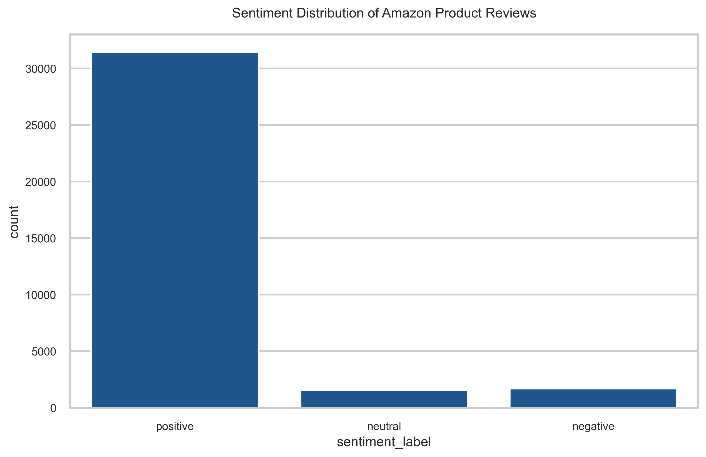
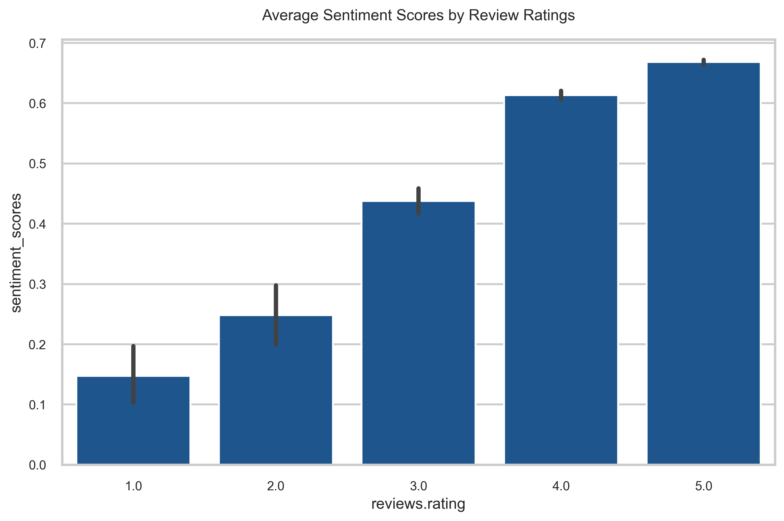
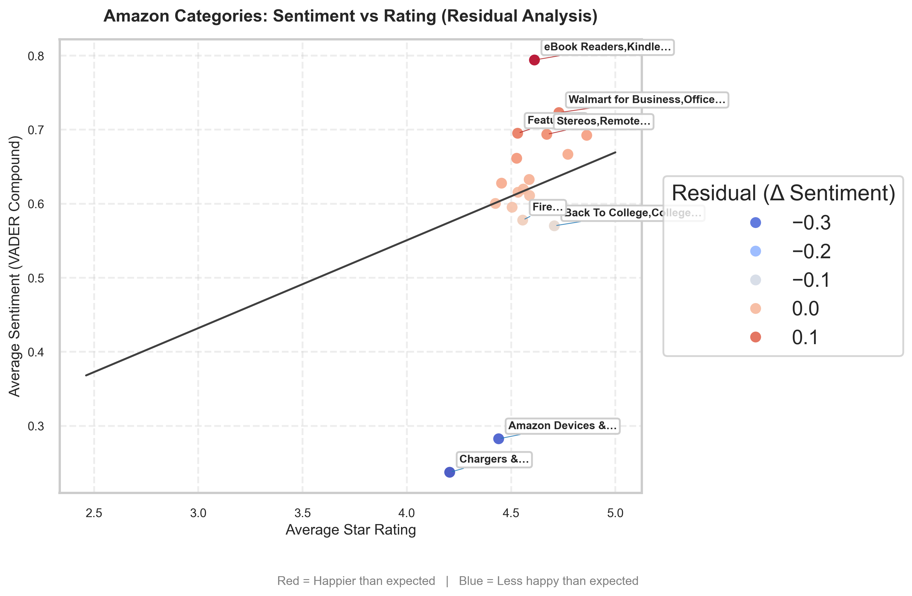
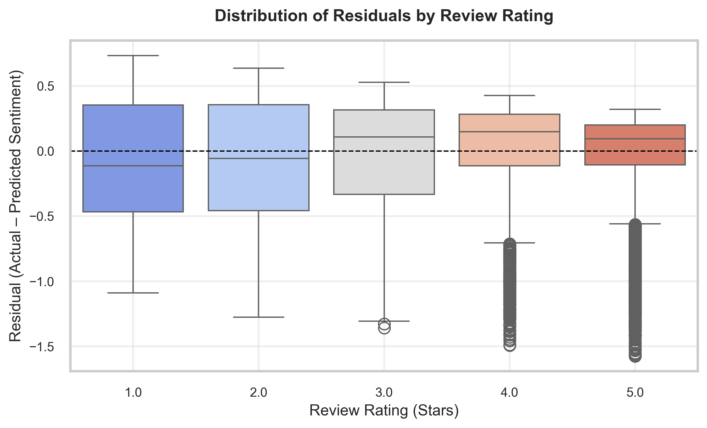
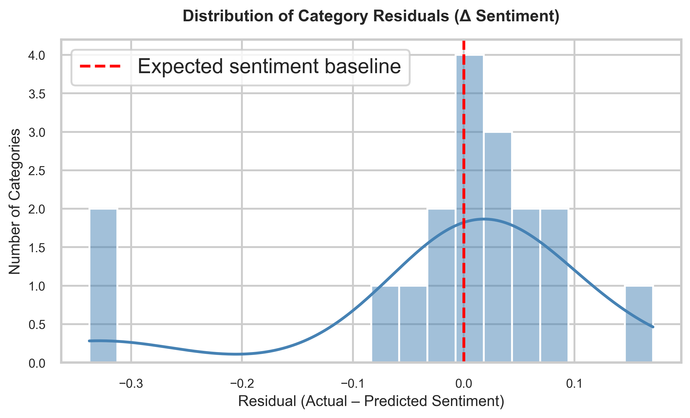

# **Amazon Product Review Sentiment Analysis**

### 📘 Overview
This project analyzes Amazon product reviews to explore how **textual sentiment** aligns with **star ratings**.  
Using **NLP and regression-based residual analysis**, it uncovers *hidden dissatisfaction* — cases where the emotional tone diverges from numeric ratings.

---

### 🧠 Objectives
- Quantify correlation between sentiment (text) and star ratings  
- Identify overperforming and underperforming product categories  
- Visualize hidden emotional gaps using residual analysis  

---

### 🛠 Tech Stack
**Languages:** Python  
**Libraries:** Pandas, NumPy, Seaborn, Matplotlib, VADER Sentiment Analyzer  
**Methods:** Data cleaning, sentiment scoring, regression modeling, residual analysis, correlation computation  

---

### 📊 Key Results
| Metric | Value |
|--------|-------|
| Reviews analyzed | **34,627** |
| Categories covered | **38** |
| Rating–Sentiment Correlation | **0.237** |
| Top Overperformers | *Kindle Accessories, Kindle Touch Accessories, Amazon Streaming Devices* |
| Top Underperformers | *Fire Tablets, Tablet Accessories, Power Adapters* |

---

### 🖼 Sample Outputs

**1️⃣ Sentiment Distribution**  

**2️⃣ Average Sentiment by Rating**  

**3️⃣ Residual Analysis by Category**  

**4️⃣ Residuals by Rating**  

**5️⃣ Residual Distribution**  

---

### 💡 Impact
Residual analysis revealed that categories such as *Fire Tablets* and *Power Adapters* show **more negative sentiment than their high ratings suggest** — signaling hidden dissatisfaction.  
Meanwhile, *Kindle Accessories* and *Amazon Streaming Devices* exhibit **delight beyond ratings**.  

This project demonstrates how **sentiment analytics** can augment traditional star-rating metrics to better capture real customer experience.
